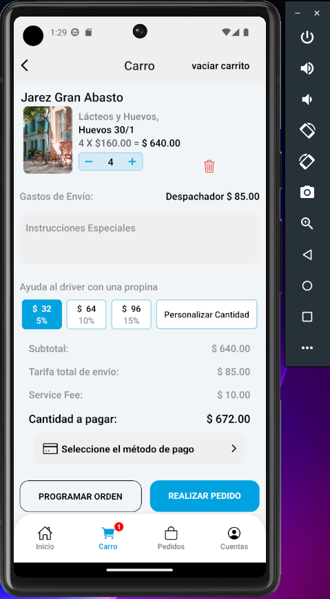

# Proyecto React Native con Expo para Speedy

La propina se calcula en base al total de la compra

## Requisitos

utilice - node js 20

expo Go o dispositivo físico conectado

android studio(para)

## Para levantar el proyecto

Sigue estos pasos para instalar y ejecutar el proyecto en tu entorno local:

### 1. Clonar el repositorio

Clona el repositorio del proyecto:
```bash
git clone https://github.com/nendy20/speedy.git
```

### 2. moverse al proyecto

Clona el repositorio del proyecto:
```bash
cd speedy
```

### 3. instalar las dependencias

Clona el repositorio del proyecto:
```bash
npm install
```


### 4. instalar las dependencias

Clona el repositorio del proyecto:
```bash
npm start
```

despues qque las opciones de desplieguen debera selecionas

```bash
a
```


### Preview


